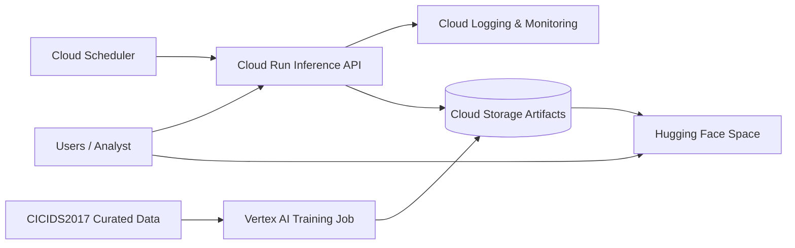

# NimbusWatch

NimbusWatch is a hybrid-cloud malicious-traffic detection project built on a curated `CICIDS2017` subset and served through a stateless `FastAPI` application.

The repo now treats **Google Cloud as the primary architecture** and **Hugging Face Spaces as the secondary demo/backup deployment**. The current model is a supervised `HistGradientBoostingClassifier` with feature selection, outlier-aware preprocessing, probability-threshold tuning, and richer evaluation artifacts.

## Final Architecture

- **Primary cloud**
  - `Vertex AI` custom job for model training
  - `Cloud Storage` for model artifacts
  - `Cloud Run` for stateless inference
  - `Cloud Logging` and `Cloud Monitoring` for support services
- **Secondary cloud**
  - `Hugging Face Spaces` for backup/public demo hosting
- **Inference contract**
  - `GET /health`
  - `GET /model-info`
  - `POST /predict`
  - `GET /`



## Model Improvements Implemented

- training-only feature selection removes low-variance and highly correlated numeric features
- preprocessing compares `StandardScaler` and `RobustScaler`
- feature distributions are clipped with percentile bounds before scaling
- skewed non-negative features are log-transformed automatically
- classifier training applies:
  - histogram gradient boosting
  - preprocessing configuration
  - feature selection
- threshold selection now optimizes a **balanced F1** objective
- saved metrics now include operational measurements such as:
  - single-row inference latency
  - model artifact size

Artifacts written after training:

- `model.joblib`
- `feature_schema.json`
- `demo_scenarios.json`
- `metrics.json`
- `training_summary.json`

`metrics.json` now contains:

- `validation`
- `test`
- `operational`

`training_summary.json` now includes:

- selected feature count and selected features
- feature-selection summary
- chosen preprocessing configuration
- total experiment count
- top experiment configurations

## Repository Highlights

- `src/models/train.py`
  - model training, feature selection, tuning, evaluation, artifact export
- `src/models/preprocessing.py`
  - dataset preparation and robust preprocessing logic
- `src/api/`
  - inference app and prediction flow
- `scripts/deploy_cloud_run.ps1`
  - deploy stateless inference to `Cloud Run`
- `scripts/submit_vertex_job.ps1`
  - submit managed training to `Vertex AI`
- `scripts/sync_huggingface_bundle.ps1`
  - package the backup `Hugging Face` deployment from the latest artifacts
- [docs/ARCHITECTURE.md](/d:/Abd/Programming/NimbusWatch/docs/ARCHITECTURE.md)
  - cloud architecture, tradeoffs, and report mapping
- [docs/FINAL_REPORT_GUIDE.md](/d:/Abd/Programming/NimbusWatch/docs/FINAL_REPORT_GUIDE.md)
  - report-ready content for the submission

## Local Setup

```powershell
python -m venv .venv
. .\.venv\Scripts\Activate.ps1
pip install -r requirements.txt
```

## Build the Curated Dataset

```powershell
python -m src.data.build_subset `
  --csv-paths "D:\data\Tuesday-WorkingHours.pcap_ISCX.csv,D:\data\Thursday-WorkingHours-Morning-WebAttacks.pcap_ISCX.csv,D:\data\Friday-WorkingHours-Afternoon-DDos.pcap_ISCX.csv" `
  --output-path "data\processed\cicids2017_curated.csv" `
  --shuffle-output
```

Optional dataset-balancing controls:

- `--benign-per-file`
- `--attack-cap-per-label`
- `--shuffle-output`

## Train the Model

### Local training

```powershell
.\scripts\train_local.ps1 -CsvPaths "data\processed\cicids2017_curated.csv"
```

### Local training plus artifact upload to GCS

```powershell
.\scripts\train_local.ps1 `
  -CsvPaths "data\processed\cicids2017_curated.csv" `
  -ArtifactGcsUri "gs://your-artifact-bucket/nimbuswatch/latest"
```

Expected outputs:

- `artifacts/generated/model.joblib`
- `artifacts/generated/feature_schema.json`
- `artifacts/generated/demo_scenarios.json`
- `artifacts/generated/metrics.json`
- `artifacts/generated/training_summary.json`

## Run the App Locally

### From local artifacts

```powershell
.\scripts\serve_local.ps1 -ArtifactDir "artifacts/generated" -Port 8000
```

### From GCS-backed artifacts

```powershell
.\scripts\serve_local.ps1 `
  -ArtifactDir "artifacts/generated" `
  -ArtifactGcsUri "gs://your-artifact-bucket/nimbuswatch/latest" `
  -Port 8000
```

Open `http://localhost:8000`.

The home page now has two paths:

- `Guided Demo`
  - best for judges or non-technical users
  - choose a prepared traffic scenario and run prediction without filling all model fields
- `Advanced Mode`
  - best for technical users who already have extracted flow metrics
  - enter the exact trained feature values manually or upload a one-row CSV using the downloadable template

Important: the app does **not** extract features from raw `.pcap` files in the browser. The model expects pre-extracted network-flow features such as timing, packet sizes, rates, and TCP flag counts.

## Google Cloud Deployment

### Build container images

```powershell
.\scripts\build_images.ps1 -ProjectId "<gcp-project-id>" -Region "<gcp-region>"
```

### Submit managed training

```powershell
.\scripts\submit_vertex_job.ps1 `
  -ProjectId "<gcp-project-id>" `
  -Region "<gcp-region>" `
  -StagingBucket "gs://<staging-bucket>" `
  -ArtifactBucketUri "gs://<artifact-bucket>/nimbuswatch/latest" `
  -TrainingImageUri "<region>-docker.pkg.dev/<project>/<repo>/nimbuswatch-train:latest" `
  -CsvGcsPaths "gs://<bucket>/datasets/cicids2017_curated.csv"
```

### Deploy inference to Cloud Run

```powershell
.\scripts\deploy_cloud_run.ps1 `
  -ProjectId "<gcp-project-id>" `
  -Region "<gcp-region>" `
  -ServiceName "nimbuswatch-api" `
  -ImageUri "<region>-docker.pkg.dev/<project>/<repo>/nimbuswatch-serve:latest" `
  -ArtifactBucketUri "gs://<artifact-bucket>/nimbuswatch/latest"
```

### Create a health-check scheduler job

```powershell
.\scripts\create_health_scheduler_job.ps1 `
  -ProjectId "<gcp-project-id>" `
  -Location "<scheduler-location>" `
  -JobName "nimbuswatch-health" `
  -ServiceUrl "https://nimbuswatch-api-xxxxx.a.run.app"
```

## Hugging Face Secondary Deployment

Use a separate `Hugging Face Space` repo for the secondary deployment.

```powershell
.\scripts\sync_huggingface_bundle.ps1 -SpaceRepoPath "D:\repos\nimbuswatch-space"
```

This copies:

- `Dockerfile.serve` as the Space `Dockerfile`
- `requirements.txt`
- `src/`
- latest `artifacts/generated/`
- `HUGGINGFACE_SPACE.md` as the Space `README.md`

## Why This Fits Advanced Cloud Architecture

- training and inference are separated into independent stages
- serverless inference supports elasticity without always-on VM cost
- artifacts are stored independently from compute
- health checks and managed services support recovery and observability
- the project can be demonstrated across two cloud platforms with the same API contract

## Report and Viva

Use these repo docs directly for the final submission:

- [docs/FINAL_REPORT_GUIDE.md](/d:/Abd/Programming/NimbusWatch/docs/FINAL_REPORT_GUIDE.md)
- [docs/ARCHITECTURE.md](/d:/Abd/Programming/NimbusWatch/docs/ARCHITECTURE.md)
- [DEMO.md](/d:/Abd/Programming/NimbusWatch/DEMO.md)

## Test

```powershell
pytest
```

## Notes

- the repo does **not** claim automatic multi-cloud failover
- the current backup flow to `Hugging Face` is manual or semi-manual
- guided demo scenarios come from `demo_scenarios.json` aligned to the current trained feature schema
- production metrics in `artifacts/generated` should be refreshed by retraining on the full curated dataset before final submission
